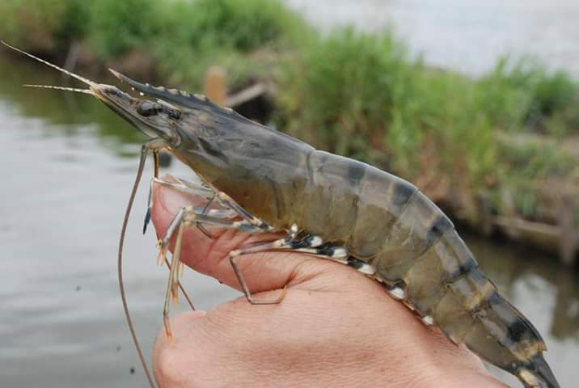

# Review of literature

## Overview of aquaculture

### Present status of aquaculture

Aquaculture production has grown rapidly over the past four decades,
contributing significant quantities to the world's supply of fish for
human consumption. Aquaculture now accounts for almost 53% of the
world's food fish. (FAO, 2018). With its continued growth, it is
expected that aquaculture will, in the near future, produce more fish
for direct human consumption than capture fisheries (Subasinghe et al.,
2009). Bangladesh is considered one of the most suitable regions for
fisheries in the world, with the world's largest flooded wetland and the
third largest aquatic biodiversity in Asia after China and India
(Shamsuzzaman et al., 2017) Fish is the second most valuable
agricultural crop in Bangladesh and its production contributes to the
livelihoods and employment of millions of people. The culture and
consumption of fish therefore has important implications for national
income and food security. Bangladeshi people are popularly referred to
as "Mache Bhate Bangali" or "fish and rice makes a Bengali" (Ghose,
2014).Global production of fish, crustaceans, molluscs and other aquatic
animals continued to grow and reached 169.2 million tonnes in 2015. Of
this total, aquaculture production was 76.6 million tonnes in 2015, up
by 4 percent from previous year. (FAO, 2018).

Bangladesh is one of the world's leading fish producing countries with a
total production of 4.134 million MT in 2016-17, of which inland open
water (capture) contributes 28.14% and inland closed water (culture)
contributes 56.44% of total production. Several statistics represented
that the annual growth rate of total fish production in 2016-2017 was
6.60%. This increasing aquaculture growth rate revealed more than five
times country's aquaculture production (7.54 MT in 1983-84 to 41.34 lakh
MT in 2016-17) over the last three decades Government is trying to
sustain this growth performance, which eventually ensures to achieve the
projected production target of 4.55 million MT by 2020-21. Recently,
Bangladesh has been ranked as the fifth position in world aquaculture
production (DoF, 2017).

The total first sale value of fisheries and aquaculture production in
2016 was estimated at USD 362 billion, of which USD 232 billion was from
aquaculture production.(FAO, 2018). The total production included 80.0
million tonnes of food fish (USD 231.6 billion) and 30.1 million tonnes
of aquatic plants (USD 11.7 billion) as well as 37 900 tonnes of
non-food products (USD 214.6 million). Farmed food fish production
included 54.1 million tonnes of finfish (USD 138.5 billion), 17.1
million tonnes of molluscs (USD 29.2 billion), 7.9 million tonnes of
crustaceans (USD 57.1 billion) and 938 500 tonnes of other aquatic
animals (USD 6.8 billion) such as turtles, sea cucumbers, sea urchins,
frogs and edible jellyfish.

Shrimp is one of the major export items in Bangladesh. This sector is
contributing significantly in food security through proving safe and
quality animal protein; almost 60 percent animal protein comes from
fish. It contributes 3.61 percent to our national GDP and around
one-fourth (24.41 percent) to the agricultural GDP. This sector also has
high potential for the perspective of economic development of the
country. Bangladesh earns a considerable amount of foreign currencies by
exporting fish, shrimps and other fisheries products. Bangladesh exports
frozen shrimp and other fish and fisheries products to more than 50
countries, including Belgium UK, Netherlands, Germany, USA, China,
France, Russian Federation, Japan and Saudi Arabia. In 2016-17, the
country earns BDT 42876.40 million by exporting almost 68.31 thousand MT
of fish and fisheries products. This success is due to export of quality
shrimp introducing HACCP procedure and traceability regulation according
to the requirement of European Union (EU) and USA (DoF, 2017).

Aquaculture contribute significantly for the livelihood of a huge number
of people, for instance about 56.5 million people were engaged in the
primary sector of capture fisheries (67) and aquaculture (33%). In
addition, this sector brought women at nearly 19% of the primary
workforce (FAO, 2017). More than 11 percent of total population of
Bangladesh are engaged with this sector either on full time or part time
basis for their livelihoods (DoF, 2017).

Commercial shrimp feed constitutes 50--60% operational cost of intensive
shrimp farming (Wasielesky et al., 2006). So, formulation of
nutritionally balanced feed with quality dietary supplement is an
imperative area of research to meet the nutritional demand and maximize
the growth of shrimp. Most commonly used dietary supplements in penaeid
shrimp diets are microalgae (Ju et al., 2009; Supamattaya et al., 2005),
seaweed (Yeh et al., 2006), herbal extract (Sankar et al., 2011), yeast
(Yang et al., 2010), probiotics (Wang, 2007; Ziaei-Nejad et al., 2006),
carotenoids (Boonyaratpalin et al., 2001) and prebiotics (Zhang et al.,
2012). (Anand et al., 2013). The domestic source of better quality fish
meal (44--52% crude protein content) is the chewa (Pseudapocryptes
elongates), supplied in southern Bangladesh in Kuakata and the islands
of Hatia and Bohala, but amounts available are insufficient to meet the
demand of the feed sector. An approximate calculation indicates that the
annual catch of fresh trash fish is close to 0.15 million tonnes; equal
to approximately 0.0375 million tonnes of fish meal. Considering that
most feed producers aim for at least 5% inclusion of fish meal, this
quantity of supply is insufficient to meet demand. (Rashid et al.,
2013).

## Problems in Aquaculture

### General Problems

Under good management, several technical difficulties may arise during
fish culture with a possibility of large scale loss of production. Some
of such common difficulties in fish ponds/ fish culture are- Deep green
water color, muddy pond water, red layer on pond water, oxygen depletion
in pond water and fish grasping for air, excess ammonia, hydrogen
sulphide, dark mud at bottom, larger aquatic plants in pond and so on
(Hussain et al., 2016)

### Diseases

The diseases of cultured penaeid shrimp include syndromes with
infectious and non-infectious etiologies. The common infectious diseases
which cause significant economic loses in shrimp culture are with viral,
rickettsial, bacterial, fungal, protistan and metazoan etiologies
(Lightner, 1988, 1993a, 1996; Brock and Lightner, 1990; Fulks and Main,
1992; Johnson, 1995). A number of noninfectious diseases are also of
importance to the industry, and included among these are diseases due to
environmental extremities, nutritional imbalances, toxicants, and
genetic factors (Lightner, 1988; Brock and Lightner, 1990b; Brock, 1992;
Johnson, 1995; Lightner, 1996).

Table 1.1 Major diseases of IndoPacific and east Asian penaeid shrimp
(Lightner & redman, 1998).

| Viral diseases    | Bacterial and fungal | Other diseases           |
|-------------------|----------------------|--------------------------|
| White spot group  | Vibriosis:           | Epicommensals            |
| Yellow head virus | -Septic HP necrosis  | \- Leucothrix mucor      |
| BMN group         | -Hatchery vibriosis  | \- Peritrich protozoans  |
| MBV group         | -Luminescent Vibrio  | Gregarines               |
| IHHNV             | Rickettsia           | Microsporidians          |
| HPV               | Larval mycosis       | Nutritional imbalances   |
| REO group         | Fusariosis           | Toxic syndromes          |
|                   |                      | Environmental syndromes  |
|                   |                      | One month death syndrome |

### Environmental problem

Land-based fish farms live in tanks containing dirty water that must be
changed. Depending on the system's set-up, this can result in the
discharge of significant amounts of wastewater containing feces,
nutrients and chemicals released into the environment. The release of
this matter can result in algae blooms which eventually remove dissolved
oxygen in the receiving waterway (Michael, 2018).

## Development of Shrimp feed

### Overview of feed production

Production of commercial feeds has increased at an average rate of 32%
per year over the period 2008--2012, and has reached an estimated total
of almost 1.07 million tonnes in 2012. Sinking feeds, which accounted
for 81% of total manufactured output, still dominate over extruded
floating feed (19%), but growth in the production of floating fish feed
has been fastest, averaging 89% over the last four years. Around 100
commercial mills produce aquaculture feeds in Bangladesh. (Rashed et
al., 2013).

### Alternative protein sources

### Replacement with plant protein {.unnumbered}

Fish meal is currently one of the major sources of animal protein used
in diets for marine shrimp (Sá et al., 2013). Protein is the most
expensive ingredient in the diet, and its quality is a very important
nutritional aspect in aquaculture (Gomez et al., 2008). Fish meal
production has declined by an average of 1.7% per year over the past 15
years (1994-2009), limiting the supply of this input and thus increasing
its cost (FAO, 2012). This reality can make the production of many
aquatic species economically unfeasible. Among the plant protein
sources, soybean protein concentrate and soybean meal are noteworthy
because of the wide availability of soybeans in the market. However,
soybean protein concentrate is a more refined protein source, with up to
65% protein content and a reduced concentration of anti-nutritional
factors (NRC, 2011). When compared with fish meal, soybean protein
concentrate is deficient in methionine (Drew et al., 2007). However, it
has a low carbohydrate and fiber content, high digestibility, and a good
amino acid balance, compared with other protein sources of vegetable
origin (Gamboa-Delgado et al., 2013). Despite these advantages, not much
is known about the use of this ingredient in marine shrimp farming,
including Pacific white shrimp (Soares et al., 2015)

### Replacement of microbial protein {.unnumbered}

Naturally occurring organisms may contribute nutritionally and serve as
a pre-/probiotic and/or unknown growth promoter. For these reasons, it
was hypothesized that production of microbial flocs in sequencing batch
reactors (SBRs) using effluent from a tilapia production facility and a
carbon source (e.g. sugar) could produce a viable alternative ingredient
for shrimp feed. Microbial flocs produced in SBRs could be dried and
incorporated into a pelleted feed for shrimp. If this alternative feed
proved to be successful, it could offer the shrimp industry a new
culture option in clear water recirculating aquaculture systems (Kuhn et
al., 2009).

## Tiger shrimp (*Penaeus monodon*)

### Taxonomy

Penaeus monodon, commonly known as the giant tiger prawn or Asian tiger
shrimp (and also known by other common names), is a marine crustacean
that is widely reared for food. Penaeus monodon was first described by
Johan Christian Fabricius in 1798. That name was overlooked for a long
time, however, until 1949, when Lipke Holthuis clarified to which
species it referred. Holthuis also showed that P. monodon had to be the
type species of the genus Penaeus (Wikipedia, 2018).

::: {style="display: flex;"}
::: {style="flex-basis: 50%;"}
-   Kingdom: *Animalia*
-   Phylum: *Arthropoda*
-   Subphylum: *Crustacea*
-   Class: *Malacostraca*
-   Order: *Decapoda*
-   Suborder: *Dendrobranchiata*
-   Family: *Penaeidae*
-   Genus: *Penaeus*
-   Species: *P. monodon*
:::

::: {style="flex-basis: 50%;"}

:::
:::

### Habitat

Penaeus monodon is found at depths from 0 to 110 m, inhabiting bottom
mud and sand. Giant tiger prawn live in brackish, estuarine (juveniles)
and marine (adults) environments (FAO, 1980). In its natural range, P.
monodon frequents water temperatures of 18--34.5 ºC and salinitiesof
5--45 ppt (Branford, 1981; Chen, 1990). It is even grown commercially at
salinities of 1--5 ppt (Musig and Boonnom, 1998). Penaeus monodon
appears to select muddy mangrove channels and often associates with
marginal or floating vegetation (FAO, 2018).

### Reproduction

Wild males produce spermatozoa from around 35 g BW and females becomes
gravid from 70 g. Mating occurs at night, shortly after moulting, while
the cuticle is still soft, and sperm are subsequently kept in a
spermatophore (sac) inserted inside the closed thelycum of the female.
Females of P. monodon are highly fecund, with gravid individuals
producing as many as 500 000 to 750 000 eggs. Spawning occurs at night
and fertilization is external, with females releasing sperm from the
thelycum as eggs are released in offshore waters. Nauplii hatch 12--15 h
after fertilization (FAO, 2018).

### Immunity

The first immune process is the recognition of invading microorganisms,
which is mediated by the haemocytes and by plasmatic proteins. The
recognition molecules may interact with and activate the haemocytes,
which play an important and central role in host defense. The
non-self-recognition factors activate several immediate defense systems
mediated by the haemocytes. The innate immune response of arthropods
also relies upon the production of antimicrobial peptides that are
active against a large range of pathogens. Expression of the immune
effector encoding genes during the response to infections or to immune
stimulations will take place in defense reactions against some specific
harmful pathogens (Bachre, 2000).

### Shrimp cultivation

#### Traditional culture system

Shrimp are cultured under this type of management with virtually no cost
or very little cost. Only a few shrimp PL are released in the gher. No
fertilizer or supplementary feed are used in the gher, shrimp fully
depend on natural food present in the gher. Besides, neither any
initiatives are taken nor any technological aspects of farming are
considered in extensive culture method. As a result, only 0.5 kg of
shrimp per decimal are produced annually in the gher. Example can be
given as releasing shrimp PL in the gher without any calculation and not
following gradual steps of shrimp culture and harvesting shrimp
irregularly. Shrimp Pl are stocked at the rate of 10,000-- 15,000 per ha
and fry of other fishes also enter in to the gher with tidal water.
Under this culture system, the survival of shrimp is 30 and per ha
production is 150 kg.

#### Improved traditional

A little improved culture management, where shrimp PL are stocked at
relatively low density after removing aquatic weed and weed fish /
predatory fish. In addition to irregular fertilizer and feed
application, other activities of planned shrimp culture are also
performed irregularly. Presently, this type of culture management is
most commonly practiced in our country and the shrimp production in this
method is near about 1 kg / dec annually. In the improved traditional ha
stocking density is 15,000 -- 30,000 and per ha shrimp production is 400
-- 500 kg. In the case, the survival of shrimp PL is 50 -- 60 %.

#### Semi- intensive

In the semi intensive culture system, the necessary renovation of the
water body, complete control of predatory and weed fish, medium stocking
density, regular fertilizer and handmade feed application, partial
harvesting and restocking after 3-4 months of fry stocking and if
necessary water exchange and supply of oxygen (aeration) are performed.
That is, some modern technologies of shrimp culture are followed under
semi-intensive culture system. Under this type of culture management,
per decimal annual shrimp production may reach 1.5 kg or little more
than that. Under this culture method, per ha stocking density is 9,000
-- 10,000 and per ha production is 450 -- 550 kg. In the case, the
survival of shrimp PL is 70 %.

#### Ultra-intensive

The culture of shrimp using very advanced technology after costly
infrastructural restoration as necessary is known as intensive culture
system. It requires high investment and rigorous labor. Although
intensive culture system is highly profitable, it has high risk with
potential negative impact on the environment. In this system per ha
stocking density is 50,000 -- 60,000 (if ther is no aerator) and 100,000
(if there is aerator) and the production is 1200 -- 1500 kg. In the
case, the survival of shrimp PL is 80 - 90 %. (CSISA-BD project, World
Fish, 2011).

### Effect of salinity in shrimp culture

Tiger shrimp Penaeus monodon has a tolerance of a wide range of salinity
from 1 psu to 57 psu and a suitable salinity range of 10 psu to 35 psu
(Liao, 1986). In practice, farmers believe that the growth of shrimp in
lower salinity water is better than in seawater and they are likely to
add freshwater to lower the salinity levels (Wang and Chen, 2006).
However, there is no obvious evidence which showed that growth benefits
could result from such low-salinity-acclimation practices and, in fact,
why and to what degree salinity can affect growth rate and food
conversion efficiency of juvenile P. monodon is still uncertain. (Ye et
al., 2009)

### Research gap

The aquaculture research community and the aquafeeds industry have long
recognized and anticipated issues impacting the sustainability of fish
meal in aquafeeds (Barrows and Hardy, 2001). In many countries several
studies have been conducted on researching and developing aquafeeds that
use alternative protein ingredients, particularly plant-derived proteins
(Gatlin et al., 2007). By doing this again we are creating pressure on
human plant food sources, which is a question of global food security
and sustainability. Despite of that we have a huge ocean resources which
have been remained totally untouched. Presently, scientists are thinking
on using huge ocean microbial biomass diversity as the alternative
source of fish meal. However, a little literature has been found on
protein supplementation in shrimp feed with microbial proteins and its
suitability in application at different salinities.

